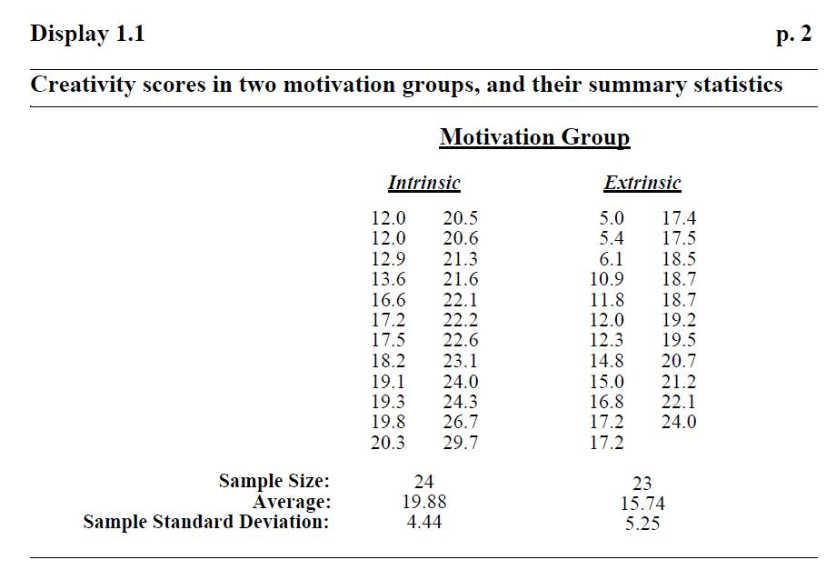
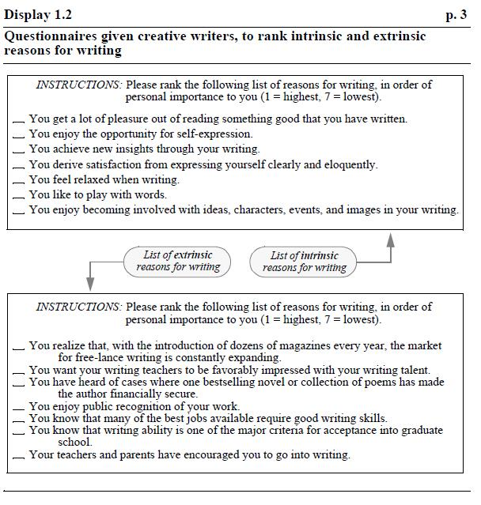
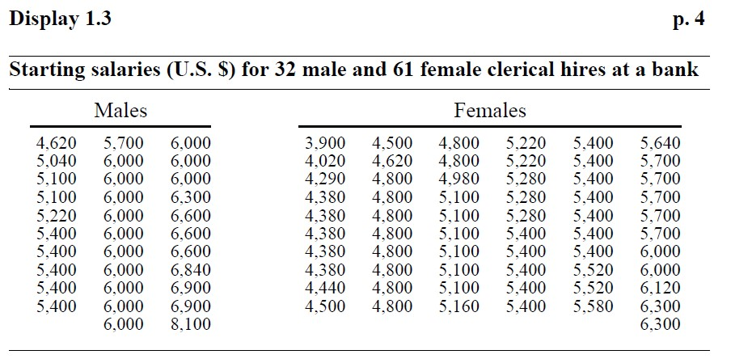
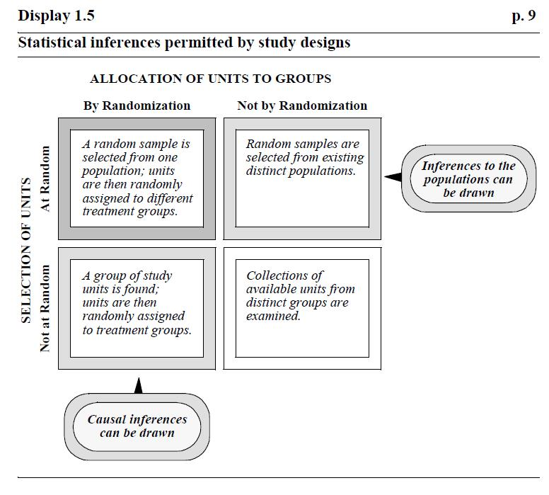
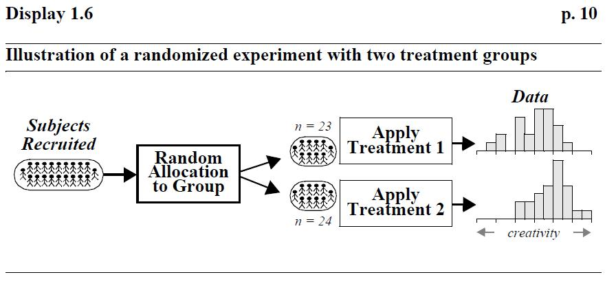
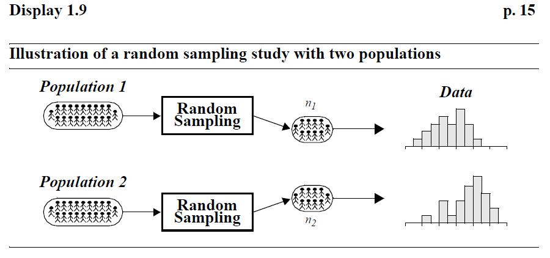

```{r setup, include=FALSE}
library(ggplot2)
theme_set(theme_bw(base_size=12))
theme_update(strip.background = element_rect(fill = "transparent", color = "black"))
knitr::opts_chunk$set(echo = TRUE,
                      fig.height=2.5, 
                      fig.width=2.8,
                      fig.align="center",
                      eval = FALSE)
```

# Motivation and Creativity - A Randomized Experiment

Do grading systems promote creativity in students?  Do ranking systems and incentive awards increase productivity among employees?  Do rewards and praise stimulate children to learn? Although reward systems are deeply embedded in schools and in the workplace, a growing body of evidence suggests that rewards may operate in precisely the opposite way from what is intended.

A remarkable demonstration of this phenomenon was provided by psychologist Teresa Amabile in an experiment concerning the effects of intrinsic and extrinsic motivation on creativity.  Subjects with considerable experience in creative writing were randomly assigned to one of two groups:  24 of the subjects were placed in the "intrinsic" treatment group and 23 in the "extrinsic" treatment group, as indicated in Figure 1.  The "intrinsic" group completed the questionnaire at the top of Figure 2. The questionnaire, which involved ranking intrinsic reasons for writing, was intended as a device to establish a thought pattern concerning intrinsic motivation - doing something because doing it brings satisfaction. The "extrinsic" group completed the questionnaire at the bottom of Figure 2, which was used as a device to get this group thinking about extrinsic motivation - doing something because a reward is associated with its completion.

After completing the questionnaire, all subjects were asked to write a poem in the Haiku style about "laughter." All poems were submitted to 12 poets, who evaluated them on a 40-point scale of creativity, based on their own subjective views. Judges were not told about the study's purpose. The average ratings given by the 12 judges are shown for each of the study subjects in Display 1.1 (Data based on the study in T. Amabile, "Motivation and Creativity: Effects of Motivational Orientation on Creative Writers." Journal of Personality and Social Psychology 48(2) (1985): 393-99). Is there any evidence that creativity scores tend to be affected by the type of motivation (intrinsic or extrinsic) induced by the questionnaires?


 


# Sex Discrimination in Employment - An Observational Study

Did a bank discriminatorily pay higher starting salaries to men than to women? The data in Display 1.3 are the beginning salaries for all 32 male and 61 female skilled, entry-level clerical employees hired by the bank between 1969 and 1977. (Data from a file made public by the defense and described by H. V. Roberts, "Harris Trust and Savings Bank: An Analysis of Employee Compensation" (1979), Report 7946, Center for Mathematical Studies in Business and Economics, University of Chicago Graduate School of Business.)









